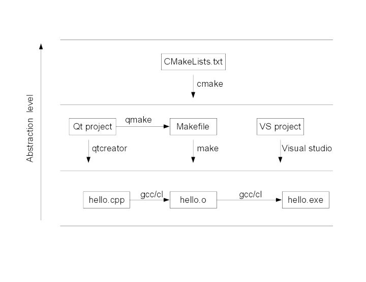

# c++编译相关知识

如下图

## gcc

gcc是GNU Compiler Collection（就是GNU编译器套件），也可以简单认为是编译器，它可以编译很多种编程语言（括C、C++、Objective-C、Fortran、Java等等）。2.当你的程序只有一个源文件时，直接就可以用gcc命令编译它。但是当你的程序包含很多个源文件时，用gcc命令逐个去编译时，你就很容易混乱而且工作量大所以出现了make工具

## g++

g++则是GCC的c++编译器。

## make

make 是用来执行Makefile的，Makefile是类unix环境下(比如Linux)的类似于批处理的"脚本"文件。其基本语法是: 目标+依赖+命令，只有在目标文件不存在，或目标比依赖的文件更旧，命令才会被执行。由此可见，Makefile和make可适用于任意工作，不限于编程。比如，可以用来管理latex。Makefile+make可理解为类unix环境下的项目管理工具，但它太基础了，抽象程度不高，而且在windows下不太友好(针对visual studio用户)，makefile在一些简单的工程完全可以人工手动操作下，但是当工程非常大的时候，手写makefile也是非常麻烦的，如果换了个平台makefile又要重新修改。，于是就有了跨平台项目管理工具cmake。
makefile命令中就包含了调用gcc（也可以是别的编译器）去编译某个源文件的命令。

## cmake

cmake是跨平台项目管理工具，它用更抽象的语法来组织项目。虽然，仍然是目标，依赖之类的东西，但更为抽象和友好，比如你可用math表示数学库，而不需要再具体指定到底是math.dll还是libmath.so，在windows下它会支持生成visual studio的工程，在linux下它会生成Makefile，甚至它还能生成eclipse工程文件。也就是说，从同一个抽象规则出发，它为各个编译器定制工程文件。 cmake是抽象层次更高的项目管理工具，cmake命令执行的CMakeLists.txt文件

## qmake

qmake是Qt专用的项目管理工具，对应的工程文件是*.pro，在Linux下面它也会生成Makefile，当然，在命令行下才会需要手动执行qmake，完全可以在qtcreator这个专用的IDE下面打开*.pro文件，使用qmake命令的繁琐细节不用你管了。
同样的工具还有autotool,但我觉得cmake更方便。最近，我已经完全转入cmake编译工程了，工程目录十分清晰。至于qmake，是qt下编译工具。

到最后CMakeLists.txt文件谁写啊？亲，是你自己手写的。

当然如果你用IDE，类似VS这些一般它都能帮你弄好了，你只需要按一下那个三角形

接着是qmake，qmake是什么，先说一下Qt这个东西。Qt是跨平台C++图形用户界面应用程序开发框架。它既可以开发GUI程序，也可用于开发非GUI程序，比如控制台工具和服务器。简单的说就是C++的第三方库，使用这个库你可以很容易生成windows，Linux，MAC os等等平台的图形界面。现在的Qt还包含了开发各种软件一般需要用到的功能模块（网络，数据库，XML，多线程啊等等），比你直接用C++（只带标准内裤那种）要方便和简单。

你可以用Qt简简单单就实现非常复杂的功能，是因为Qt对C++进行了扩展，你写一行代码，Qt在背后帮你写了几百上千行，而这些多出来的代码就是靠Qt专有的moc编译器（The Meta-Object Compiler）和uic编译器（User Interface Complier）来重新翻译你那一行代码。问题来了，你在进行程序编译前就必须先调用moc和uic对Qt源文件进行预处理，然后再调用编译器进行编译。上面说的那种普通makefile文件是不适用的，它没办法对qt源文件进行预处理。所以qmake就产生了。
qmake工具就是Qt公司制造出来，用来生成Qt 专用makefile文件，这种makefile文件就能自动智能调用moc和uic对源程序进行预处理和编译。qmake当然必须也是跨平台的，跟cmake一样能对应各种平台生成对应makefile文件。15.qmake是根据Qt 工程文件（.pro）来生成对应的makefile的。工程文件（.pro）相对来说比较简单，一般工程你都可以自己手写，但是一般都是由Qt的开发环境 Qt Creator自动生成的，你还是只需要按下那个邪恶三角形就完事了。

还没有完，由于qmake很简单很好用又支持跨平台，而且是可以独立于它的IDE，所以你也可以用在非Qt工程上面，照样可以生成普通的makefile，只要在pro文件中加入CONFIG -= qt  就可以了。

### cmake vs qmake
这样qmake和cmake有什么区别？      

不好意思，cmake也是同样支持Qt程序的，cmake也能生成针对qt 程序的那种特殊makefile，只是cmake的CMakeLists.txt 写起来相对与qmake的pro文件复杂点。     
qmake 是为 Qt 量身打造的，使用起来非常方便，但是cmake功能比qmake强大。     一般的Qt工程你就直接使用qmake就可以了，cmake的强大功能一般人是用不到的。     当你的工程非常大的时候，又有qt部分的子工程，又有其他语言的部分子工程，据说用cmake会方便，我也没试过。

不同平台有不同的toolchain，如gcc，msvc，ndk gcc，clang，要便于切换

参考：

[知乎](https://www.zhihu.com/question/27455963)
GNU工具链(https://zh.wikipedia.org/wiki/GNU%E5%B7%A5%E5%85%B7%E9%93%BE)
